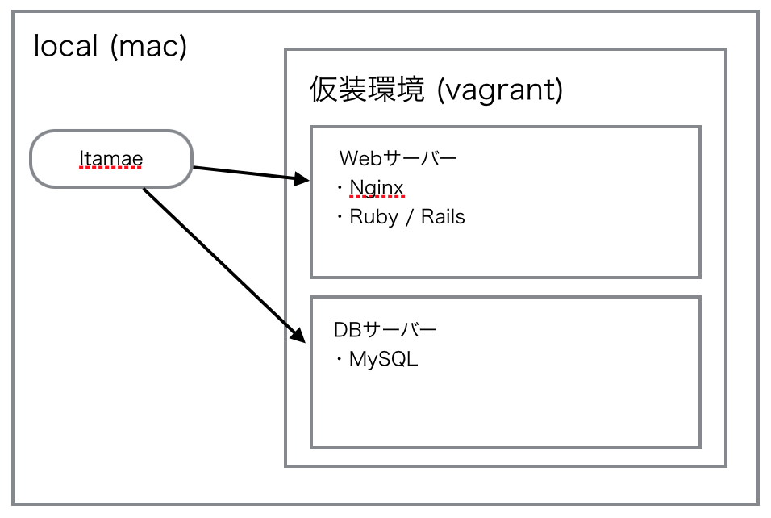

class: center, middle

# Itamaeのご紹介

---

# Agenda

1. Itamaeとは
2. Provisioningとは
3. Configurationツールの比較
4. DEMO

---

# Itamaeとは

* サーバープロビジョニングツールの一種
* しかしそもそもプロビジョニングとは？

---

# Provisioningとは

> プロビジョニング（英: Provisioning）は、本来は「準備、提供、設備」などの意味であり、現在では通常、音声通信やコンピュータなどの分野における、ユーザーや顧客へのサービス提供の仕組みを指す。
.origin[
[Wikipedia](https://ja.wikipedia.org/wiki/%E3%83%97%E3%83%AD%E3%83%93%E3%82%B8%E3%83%A7%E3%83%8B%E3%83%B3%E3%82%B0)
]

* 要するにWebサービスの文脈でいうと  
**「サービスを始めるための準備とその自動化」**  
のことだと思えば大体あってる。
* この記事が詳しいので気になったら読んでください。  
http://mizzy.org/blog/2013/10/29/1/

---

# Provisioningとは

プロビジョニングは大きく分けて3つのフェーズがある。

* Bootstrapping
  * マシンの用意
  * OSのインストール
* Configration
  * OSの設定
  * 各種ミドルウェア（Webサーバー, DBなど）のインストールとその設定
* Orchestration
  * 複数のサーバーの管理
  * 例）サーバーを新しく追加したら監視サーバーに追加登録する

---

# Provisioningとは

プロビジョニングは大きく分けて3つのフェーズがある。

* Bootstrapping .red[⬅︎AWSなどで楽になった]
  * マシンの用意
  * OSのインストール
* Configration .red[⬅︎Itamaeなどで楽になった]
  * OSの設定
  * 各種ミドルウェア（Webサーバー, DBなど）のインストールとその設定
* Orchestration .red[⬅︎別のツールが発展しつつある(Serf, Consul）]
  * 複数のサーバーの管理
  * 例）サーバーを新しく追加したら監視サーバーに追加登録する

---

# Itamaeとは

* サーバープロビジョニングツールの一種
  * サーバー構築の手順をプログラミングのコードで書くツール
  * サーバー構築が自動化 ＆ ソース管理できるようになってうれしい
* この手のツールの中でも比較的新しい
  * 類似のツールとしてはPuppet, Chef, Ansibleなど
  * 話題になってきたのは2015年の初めあたりから（実は2013年12月にfirst commitがあるが）
  * 後発なのもあってシンプルかつイージーに作られている印象

---

# Configurationツールの比較

||Puppet|Chef|Ansible|Itamae|
|:-|:-|:-|:-|:-|
|アーキテクチャ|Server/Client<sup>※1</sup>|Server/Client<sup>※1</sup>|Client|Client|
|開発言語|Ruby|Ruby|Python|Ruby|
|書き方|外部DSL|内部DSL|YAML|内部DSL|
|学習コスト|高|.red[超高]|中|低|
|パッケージのインストール|◯|◯|◯|◯|
|サービスの登録・起動|◯|◯|◯|◯|
|任意のコマンドの実行|◯|◯|◯|◯|
|テンプレート|◯|◯|◯|◯|
|リポジトリの取得|◯|◯|◯|◯|
|データの暗号化|◯|◯|◯|×|
|Role|◯|◯|◯|×|
|Node Attribute|◯|◯|◯|◯|

<small>※1 Puppet,ChefもClientのみの利用は可能</small>

---

# DEMO

以下の構成で2つのサーバーを立ててみる。

.machine-image[

]

---

# DEMO

仮装環境の準備。
```ruby:Vagrantfile
Vagrant.configure(2) do |config|
  config.vm.box = "centos/7"
  config.vm.provider "virtualbox" do |vb|
    vb.memory = "512"
  end

  config.vm.define "app", primary: true do |mm|
    mm.vm.provider "virtualbox" do |vb|
      vb.name = "app"
    end
    mm.vm.hostname = "app.example.com"
    mm.vm.network "private_network", ip: "172.30.1.10"
  end

  config.vm.define "db" do |mm|
    # 中略
  end
end
```

---

# DEMO

ツールの準備。

Gemfile
```ruby
source 'https://rubygems.org'

ruby '2.2.2'

gem 'itamae'
gem 'itamae-plugin-recipe-selinux'
gem 'serverspec'
```

インストール
```bash
$ bundle install --path .bundle
```

<small>※Chef,Ansibleと違い普段使ってるGemfileで依存関係を全て管理できるのが便利</small>

---

# DEMO

先程の図の構成の前に簡単なデモ。  
Webサーバーのインストールから起動まで。

```ruby
# プラグインでSELinuxを無効化
include_recipe 'selinux::disabled'

# Nginxをインストール
package 'nginx' do
  action :install
end

# Nginxの自動起動をOnにして起動
service 'nginx' do
  action [:enable, :start]
end

# HTMLを配置
file '/usr/share/nginx/html/hello_itamae.html' do
  owner 'root'
  group 'root'
  mode  '755'
  content '<h1>Hello Itamae!!!</h1>'
end
```

---

# DEMO

実行

```bash
# 仮装環境起動
$ vagrant up app
# Itamaeのレシピを実行
$ bundle _1.10.5_ exec itamae ssh --ohai --vagrant --host app itamae/first-recipe.rb
# 確認
$ open 'http://172.30.1.30/hello_itamae.html'
```

<small>※vagrant1.7.4ではbundleを1.10.5以下にしないとエラーが出る。</small>  
<small>※「--vagrant --host app」はVagrantに実行するためのオプション</small>  
<small>※「--ohai」はChefでも使われるサーバーの情報を取得するツールを使うオプション</small>  


---

# DEMO

次に先程の図のサーバーを構築する。

.tree[
```bash
itamae/
├── cookbooks
│   ├── app
│   │   ├── default.rb
│   ├── basic
│   │   └── default.rb
│   ├── mysql
│   │   ├── default.rb
│   │   └── files
│   │       └── etc
│   │           └── my.cnf
│   ├── nginx
│   │   └── default.rb
│   └── ruby
│       └── default.rb
├── nodes
│   ├── app-vagrant.yml
│   └── db-vagrant.yml
├── recipe.rb
└── roles
    ├── app.rb
    ├── base.rb
    └── db.rb
```
]

<small>ディレクトリ構成は自由だが、公式Wikiでベストプラクティスが提案されているのでゆるく従うのが良さそう。  
https://github.com/itamae-kitchen/itamae/wiki/Best-Practice</small>

---

# DEMO

実行

```bash
# appサーバー
bundle _1.10.5_ exec itamae ssh --ohai --vagrant \
  --host app --node-yaml itamae/nodes/app-vagrant.yml itamae/recipe.rb

# dbサーバー
bundle _1.10.5_ exec itamae ssh --ohai --vagrant \
  --host db --node-yaml itamae/nodes/db-vagrant.yml itamae/recipe.rb
```

数分後には http://172.30.1.10/ にアクセスするとRailsのトップページが見えるはず。

---

# 課題

* 意図通りのサーバーができたかの確認
  * Serverspecでテストコードを書く
* アプリケーションのデプロイは別作業
  * Itamaeで側だけ用意してCapistoranoなどでデプロイか？
  * アプリケーションのデプロイも同時にやるべきか？
  * 全体の設計による
* 実行速度が遅い
  * PackerでAMIを作成しておく
* 監視やLoadBalancerに動的に追加・削除させたい
  * Serf, Consul???（未調査）

